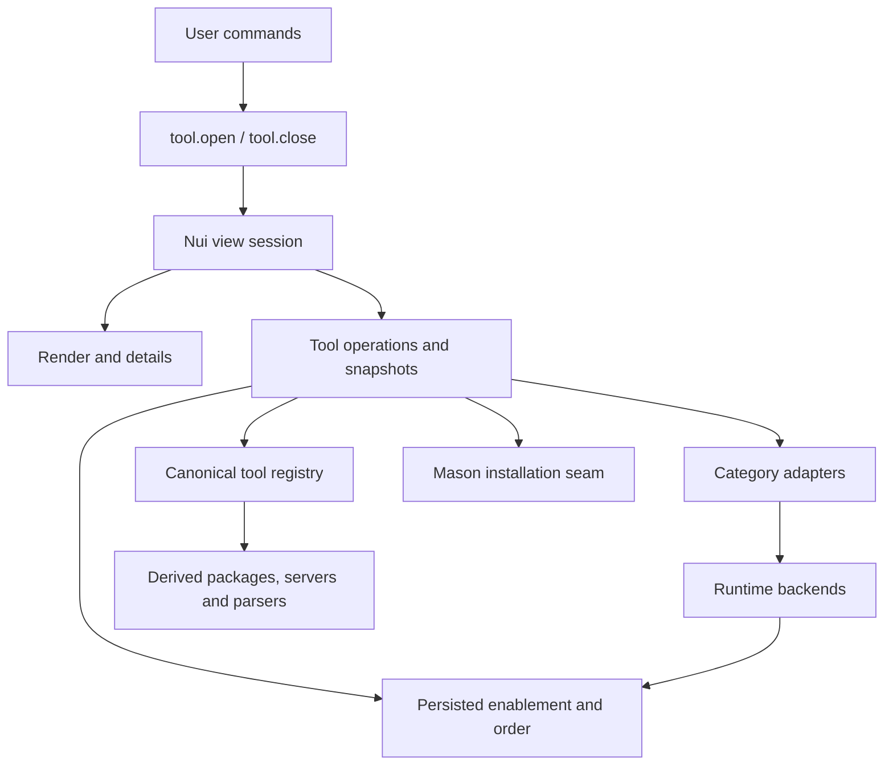

# Architecture

OrbitVim separates declarative configuration from runtime activation. `init.lua` runs editor setup before Lazy, imports plugin specifications, then registers commands and finishes theme, shell, highlight, and general-key setup.

Plugin specifications declare identity, dependencies, loading triggers, keys, and lifecycle callbacks. Editable options live in `lua/config/`; activation lives in `lua/runtime/` or the feature's owner. Importing a specification does not itself register commands/events/mappings or load highlight caches.

## Tool Manager boundaries

`lua/config/tools.lua` is the single registry for logical tool identities, supported filetypes, backend aliases, installers, and ordered defaults. `config.packages` derives sorted, unique package/server/parser lists. Supported filetypes do not imply initial runtime activation; explicit configured lists and conditions retain that responsibility.

`tool.manager` accepts selections by category, logical name, and optional filetype. It validates capabilities before changing state or invoking installers. Snapshots contain tool status, filetype groups, and summary data. They contain no Nui nodes, cursor positions, or highlight offsets.

`tool.state` reads compatible current/legacy JSON and persists logical identities. `tool.order` reconciles saved/default order with current candidates. Formatter/linter adapters translate backend identifiers at their runtime boundary and preserve unrelated runtime entries. DAP activation is shared with `runtime.dap`; parser installation uses Tree-sitter's async result.

`tool.ui.view` owns one session: Nui Layout/Popup components, view mode, source context, stable selection, mappings, event subscriptions, and timers. `tool.ui.render` builds Nui Tree/Line content; `tool.ui.details` renders selected-tool information. Mappings and help descriptions come from `config.tool_manager`.

Tool operations can outlive the view. Completion changes legitimate state/runtime behavior but only refreshes the session that initiated the operation if it is still active. Every subscription/timer is disposed when that session closes; a later view cannot inherit an earlier callback.

## Shared helpers and tests

Shared helpers expose concrete local behavior. Callers import the owning module directly; OrbitVim does not proxy arbitrary Lazy utilities. Tree-sitter predicates and SQL syntax activation belong to `runtime.treesitter`, not a generic utility facade.

`tests/core/` verifies persistence, ordering, state transitions, safety, runtime seams, and public Nui interactions without network/installations. `tests/integration/` exercises actual parsers, snippets, and the SQLFluff executable. Fixtures stay under the bootstrap's isolated test root. The test admission rules and exact validation commands are in [AGENTS](../AGENTS.md).

The design borrows the separation of state, actions, and rendering seen in [lazy.nvim](https://github.com/folke/lazy.nvim/tree/main/lua/lazy) and [mason.nvim](https://github.com/mason-org/mason.nvim/tree/main/lua/mason). [Nui](https://github.com/MunifTanjim/nui.nvim) supplies UI components; no second local windowing framework is maintained.
